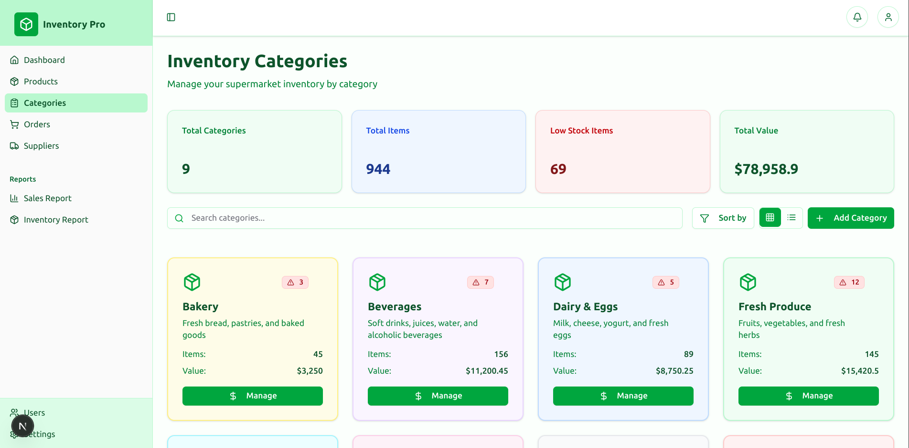
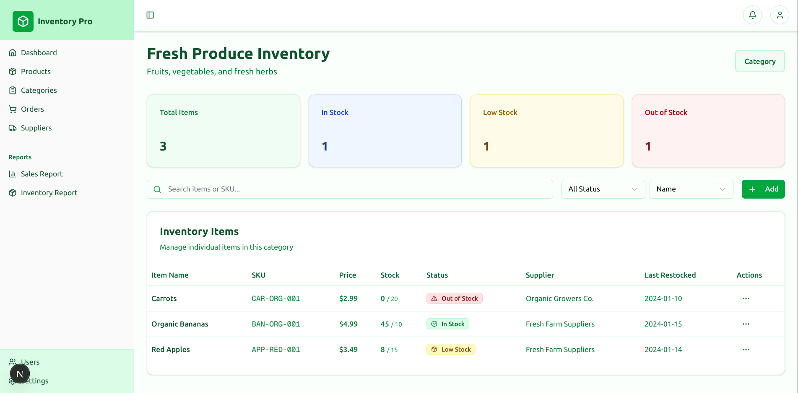
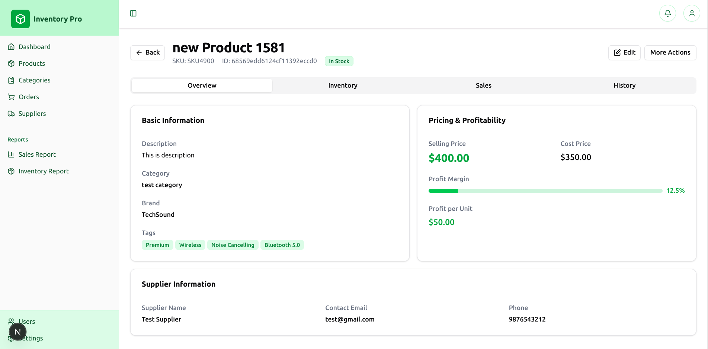
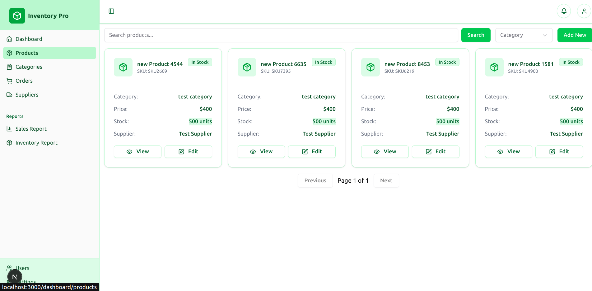
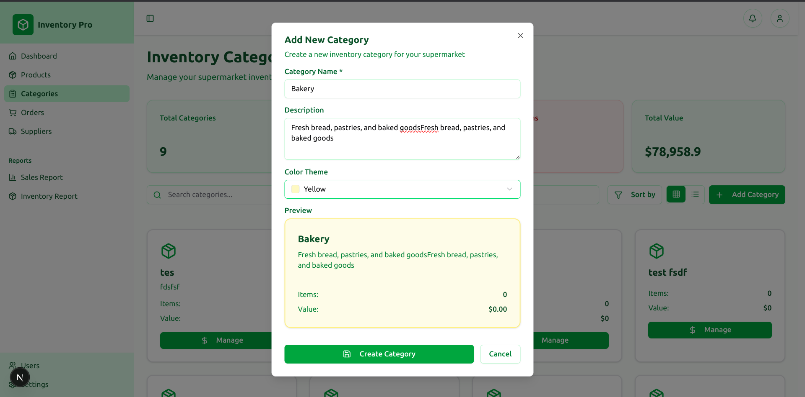
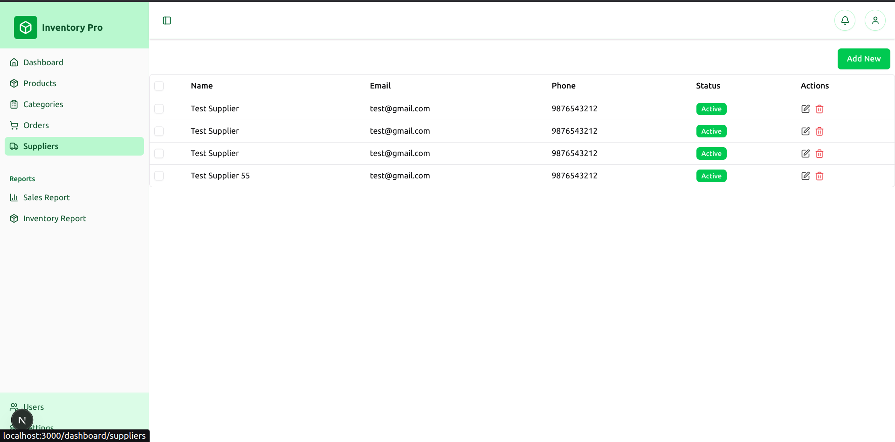
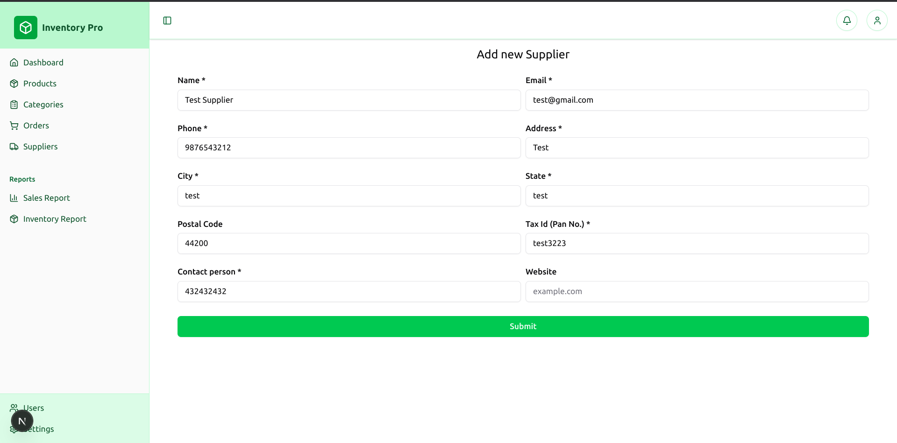

# Inventory Management System for Supermarket

## Overview

The Inventory Management System is designed to simplify the management of supermarket inventory. It enables efficient tracking of stock levels, managing product details, and generating insightful reports to optimize operations.

## Features

- **Product Management**: Easily add, update, and delete product details.
- **Stock Tracking**: Monitor stock levels and receive alerts for low inventory.
- **Reporting**: Generate detailed sales and inventory reports.
- **Search Functionality**: Quickly locate products using advanced search filters.

## Technologies Used

- **Frontend**: Next.js (TypeScript)
- **Backend**: Next.js Server Actions
- **Database**: MongoDB

## Screenshots









## Installation

Follow these steps to set up the project:

1. Clone the repository:

    ```bash
    git clone https://github.com/yourusername/inventory-management-system.git
    ```

2. Navigate to the project directory:

    ```bash
    cd inventory-management-system
    ```
3. Install dependencies:
    ```bash
    npm install
    ```
4. Configure the database:
    - Set up a MongoDB instance.
    - Create a `.env.local` file in the root directory and add the following:
      ```env
      MONGODB_URI=your-mongodb-connection-string
      ```
5. Start the application:
    ```bash
    npm run dev
    ```

## Usage
- Open your browser and navigate to `http://localhost:3000`.
- Use the intuitive interface to manage supermarket inventory seamlessly.

## Contributing
We welcome contributions! To contribute:

1. Fork the repository.
2. Create a new branch:
    ```bash
    git checkout -b feature-name
    ```
3. Commit your changes:
    ```bash
    git commit -m "Add feature description"
    ```
4. Push to your branch:
    ```bash
    git push origin feature-name
    ```
5. Open a pull request.

## License
This project is licensed under the MIT License. See the `LICENSE` file for more details.

## Contact
For any inquiries, feel free to reach out via [your email or GitHub profile].
